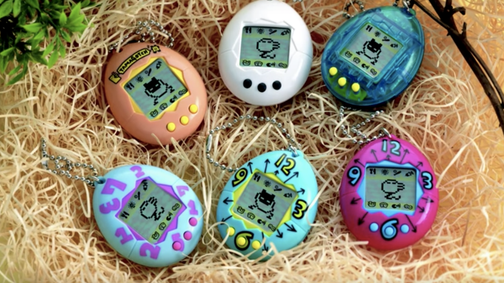
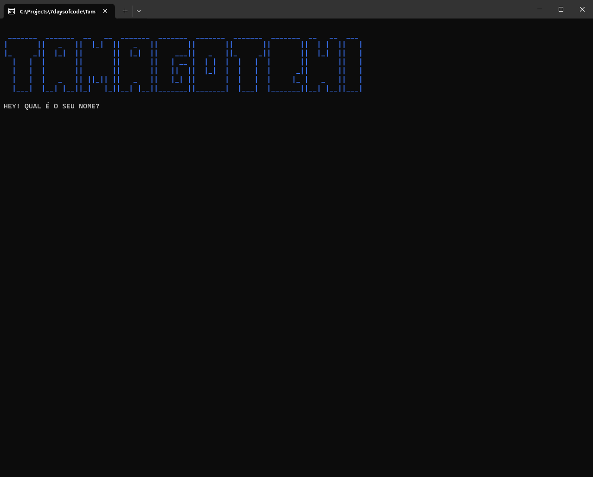

# Tamagotchi

*Foto: Canaltech*

## Descrição

Desafio do 7 Days of Code em C#, criado pela Giulia Bordignon.

A proposta foi criar uma aplicação de console que simula a interação com um Tamagotchi, consumindo a [PokéAPI](https://pokeapi.co/) para utilizar os dados dos Pokémon para representar os mascotes da aplicação.

O projeto envolveu: consumo de API com RestSharp, deserialização de JSON, arquitetura MVC (Model-View-Controller), mapeamento de propriedades com AutoMapper e tratamento de erros.

- [Anúncio do desafio no Instagram da Gi](https://www.instagram.com/reel/C2msLxpgEZZ/?igsh=aTNtdHE3dHV5M3By)
- [Link de inscrição no site 7 Days of Code](https://7daysofcode.io/matricula/csharp)

## Demo

